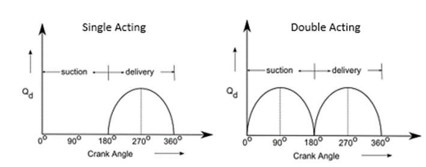
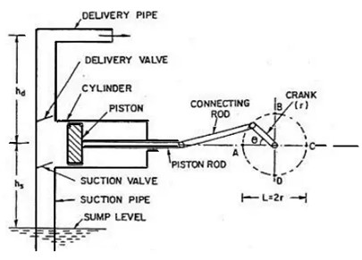
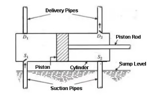

<b>Introduction</b> 
When mechanical energy is converted into stored mechanical energy or pressure energy by help of suction of the liquid into the cylinder with the help of the piston inside a cylinder which is reciprocating forward and backward, which in turn exerts the thrust on the liquid and henceforth increases its hydraulic energy or pressure energy. This kind of hydraulic machine is termed as reciprocating pump.  
A reciprocating pump is also known as positive displacement pump. Since it discharges a fixed quantity of liquid. Reciprocating pump is mostly used in applications where a small volume of liquid is to be handled and delivery pressure requirement are quite high. Broadly, there are two types of reciprocating pump,   
<b>Parts of a Reciprocating Pump</b> 

 
Fig. 1: Basic parts of Reciprocating Pump  

The following are the basic parts of the reciprocating pump. 
1.	Cylinder 
2. Suction Pipe 
3.	Delivery Pipe 
4. Suction valve 
5.	Delivery valve             	
6. Piston and piston rod 
7.	Crank and connecting rod         
8. Strainer 
9.	Air vessels  

<b>1. Cylinder</b>  
The cylindrical cavity in which the piston moves to and fro is called Cylinder. The to and fro movement of the piston is obtained by a connecting rod, which connects the piston and crank. 

<b>2. Suction Pipe</b> 
Is a pipe which connects source of water to the cylinder. It lets the water into the cylinder during suction stroke. 

<b>3. Delivery Pipe</b>  
The delivery pipe connects the pump cylinder to the discharge outlet. 

<b>4. Suction Valve</b> 
In this valve, the flow of water enters from the suction pipe into the cylinder. It allows uni-directional flow of the liquid. Hence it is also known as a non-return valve. This valve is found on the suction pipe inlet. 

<b>5. Delivery Valve</b> 
With this valve, the flow of water is discharged from the cylinder into the delivery pipe. It is also a non-return valve located between the delivery pipe outlets. The valve is in the closed position during suction. 

<b>6. Piston head and piston rod</b> 
Piston head is a solid part attached to one of the end of the piston rod. Piston head fits tightly inside the cylinder and creates vacuum for suction of the liquid during suction stroke. While  the piston rod helps the piston to move in a linear direction and its other end is connected to connecting rod 

<b>7. Crank and connecting rod</b>  
Crank and connecting rod convert rotatory motion of the motor shaft into the linear motion of piston. A crank is a circular disc that is connected to a motor. While the connecting rod connects the crank to the piston rod.  

<b>8. Strainer</b> 
A strainer is essentially a sieve kind of filter which prevents the entry of solids from the water source into the cylinders. 

<b>9. Air Vessels</b> 
It is a closed chamber made up of cast iron. It has two ends. One end is open at its base through which the water flows into the vessel cylinder. The air vessels are fitted on the suction pipe and delivery pipe of reciprocating pump to obtain a uniform discharge. 

 
Fig. 2: Air Vessels in Reciprocating Pump   

Functions of Air Vessels 

•	The air vessels is used to obtain continuous flow of water at a uniform rate. 
•	Reduces work loss due to overcoming the frictional resistance in the suction pipe and delivery pipe. 
•	To run the pump at high speed with separation, 

<!--   -->

<b>	Working Principle of Reciprocating Pumps</b> 

 

Graph. 1: Cycle of a) Single Acting, and b) Double Acting reciprocating pump  

Following are the two different working principles: 
•	Single-acting reciprocating pump  
•	A double-acting reciprocating pump  

<b>4.1	Single Acting Reciprocating Pump</b> 

 
Fig. 3: Single Acting Reciprocating Pump  

A single acting reciprocating pump has one suction pipe and one delivery pipe. It is usually placed above the liquid level in the pump. When the crank rotates the piston moves backward and forward inside the cylinder. The pump operates as follows: - 
(1) Let us suppose that initially the crank is at the inner dead center (I.D.C) and crank rotates in the clockwise direction. As the crank rotates, the piston moves towards right and a vacuum is created on the left side of the piston. This vacuum causes suction valve to open and consequently the liquid is forced from the sump into the left side of the piston. When the crank is at out dead center (O.D.C) the suction stroke is complete and left side of the cylinder is full of liquid. 
(2)	When the crank further turns from O.D.C to I.D.C, the piston moves inward to the left and high pressure is built up in the cylinder. The delivery valve opens and the liquid is forced into the delivery pipe. The liquid is carried to the discharge tank through the delivery pipe. At the end of the delivery stroke the crank comes to the I.D.C and the piston is at the extreme left position. 

<b>4.2	Double Acting Reciprocating Pump</b> 

 
Fig. 4: Double Acting Reciprocating Pump:  

In double acting reciprocating pump, suction and delivery strokes occur simultaneously. When the crank rotates from I.D.C in the clockwise direction, a vacuum is created on the left side of piston and the liquid is sucked in from the sump through valve S1. At the same time, the liquid on the right side of the piston is pressed and a high pressure causes the delivery valve D2 to open and the liquid is passed on to the discharge tank. This operation continues till the crank reached O.D.C. 
With further rotation of the crank, the liquid is sucked from the sump through the suction valve S2 and is delivered to the discharge tank through the delivery valve D1. When the crank reached I.D.C, the piston is in the extreme left position. Thus, one cycle is completed and as the crank further rotates, cycles are repeated.  
By virtue of continuous delivery strokes, a double-acting reciprocating pump gives more uniform discharges compared to a single-acting reciprocating pump which pumps liquid intermittently. To achieve even more uniform flow of liquid, invariably a multi-cylinder arrangement having two or more cylinders is employed. 

<!-- <b>5 Advantages of Reciprocating Pump</b> 

The advantages of Reciprocating Pump include the following. 
•	No priming required 
•	Pressure and flow rate changes have little effect on performance 
•	Reciprocating pumps generally operate at higher efficiencies than other pumps, generally reaching levels of 85% or more efficiency 
•	A reciprocating pump provides a steady, unchanging flow rate 

<b>6 Disadvantages of Reciprocating Pump</b> 

The disadvantages of the Reciprocating Pump include the following. 
•	Pulsating flow 
•	Typically handles only low flow rates 
•	High operating and maintenance cost 
•	Not able to handle dirty water  -->
